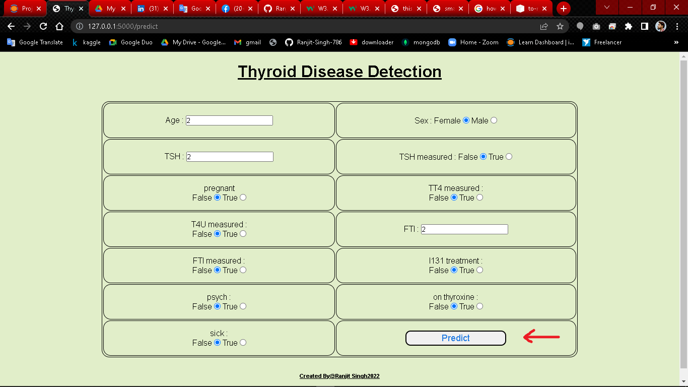
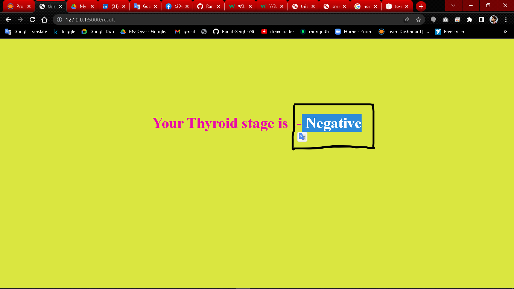

# Thyroid-Disease_ML-Project 🚑
## Description
this is Thyroid Disease Detection Project in medical pharma.
At least a person out of ten is suffered from thyroid disease in India. The disorder of thyroid disease primarily happens in the women having the age of 17–54. The extreme stage of thyroid results in cardiovascular complications, increase in blood pressure, maximizes the cholesterol level, depression and decreased fertility. The hormones, total serum thyroxin (T4) and totalserum triiodothyronine (T3) are the two active thyroid hormones produced by the thyroid gland to control the metabolism of body.
so this project can detect the thyroid disease.
### To install all Dependencies for this project. 

pip install -r requirements.txt

### steps to execute this project
<ul>
<li>clone this project.</li>
<li>go inside the current working directory.</li>
<li>open the command prompt at this location.</li>
<li>execute the "python app.py"</li>
<li>get the linc past on your browser.<li>
</ul>

### click on the prediction button to Detect the disease.

### fill out all the details in this form.

### finally you can see the Prediction.

## Thank you 🌝

